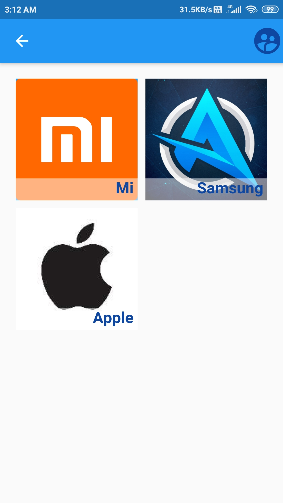
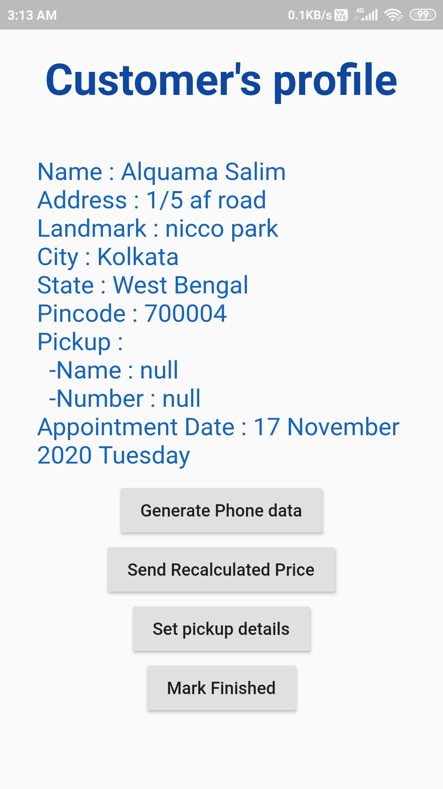

# Blue Phone Base
This is an online phone reselling system backed by firebase.
 
 

## The system
This consists of three apps 
* Blue Phone Base 
     The app for consumers where they will place a request allong with details which will be saved in firebase. 
    
* Appointments
     Here the requests will be received from the consumers and the executives will be able to communicate with them. 
    
* Blue Back
     This one is for backend data managenment like adding of new phones as an option or fluctuating the price etc. 
 UI is still under development
 More screnshots may be found in screens folder
 releases may be found in release folder 
